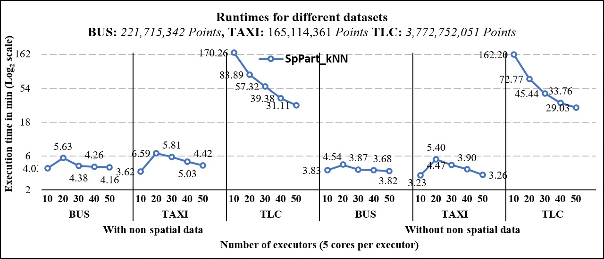
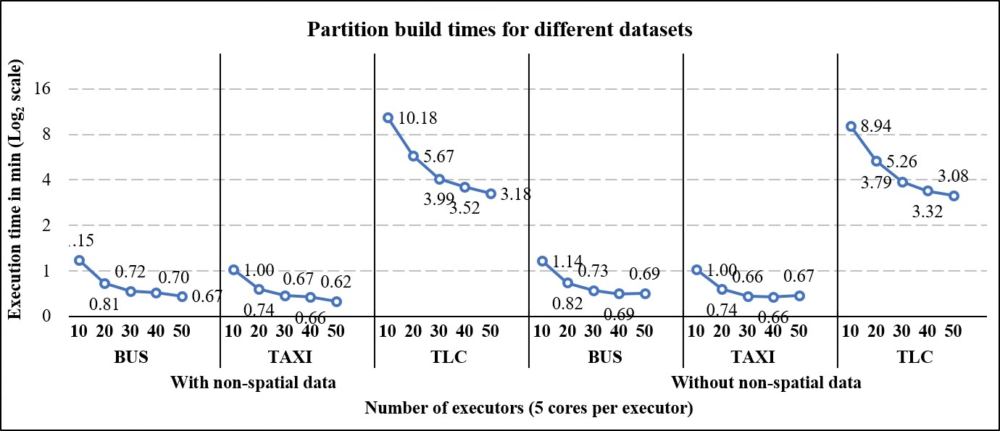
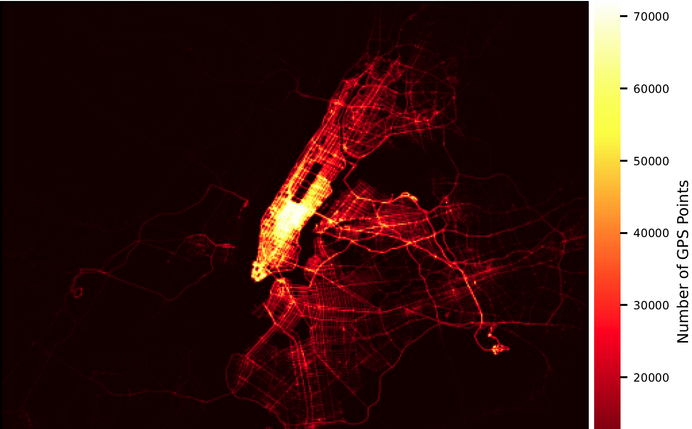

# Spatial Data Partitioning and kNN Spatial Join Query for Apache Spark

  <table width="100%" border="0" cellspacing="0" cellpadding="0">
    <tbody>
      <tr>
        <td width="400" valign="top">
        
         
        </td>
        <td valign="top">
          

            
             
            
              <strong>Distribution of 3.77 billion GPS taxi trajectories.</strong>
</td></tr></tbody></table>

Spark-kNN is a novel, scalable, and efficient partitioning technique for large-scale spatial data partitioning and query execution over Apache Spark. The partitioner natively accounts for the datasets' unique spatial traits without sampling, considers the computational overhead required to handle non-spatial data, minimizes partition shuffles, computes the optimal utilization of the available computing resources, and achieves accurate results. Experimental tests show up to 1.48 times improvement in runtime and accuracy of results..

## License
This work is provided as-is under the BSD 3-clause license (https://github.com/bdilab/GeoMatch/blob/master/LICENSE), Copyright Ⓒ 2021, the City University of New York.

## Getting Started

### Dependencies
<ul>
  <li>Apache Spark 2.4.0</li>
  <li>Scala 2.11</li>
  <li>Java 1.8</li>
  <li>Locationtech JTS 1.16.1</li>
  <li>kryo 4.0</li>
</ul>

### Building Instructions
<pre>
cd Spark-kNN
mvn compile install
</pre>

### 1. Initializing Spark
This is a standard SparkContext initiliazation step including configuring Spark to use KryoSerializer. Skipping KryoSerializer may increase the processing time.
</indent>
<pre><code>
    val sparkConf = new SparkConf()

    // assumes local mode
    // cluster mode has the memory and number of cores available 
    sparkConf.setMaster("local[*]")
             .set("spark.driver.memory", "1G")
             .set("spark.executor.memory", "4G")
             .set("spark.executor.instances", "4")
             .set("spark.executor.cores", "5")

    // kryo setup
    sparkConf.setAppName(this.getClass.getName)
             .set("spark.serializer", classOf[KryoSerializer].getName)
             .set("spark.kryo.registrator", classOf[SparkKnnKryoRegistrator].getName)
</code></pre>
### 2. Parse input datasets
<pre><code>def getRDD(fileName: String): RDD[Point] =
      sc.textFile(fileName)
        .mapPartitions(_.map(line => {

          // parse the line and form the spatial object

          val parts = line.split(',')
          val coords = parts
            .map(xyStr => {
              val xy = xyStr.split(' ')

              (xy(0).toDouble.toInt, xy(1).toDouble.toInt)
            })

          (parts(0), coords(0))
        }))
        .filter(_ != null)
        .mapPartitions(_.map(row => new Point(row._2._1.toDouble, row._2._2.toDouble, row._1)))

    val rddLeft = getRDD("firstDataset.csv")
    val rddRight = getRDD("secondDataset.csv")
</code></pre>
### 3. Run kNN Spatial Join Query
<code><pre>SparkKnn(true).knnJoin(rddLeft, rddRight, SupportedSpatialIndexes.QUADTREE, 10, 100, 0)
                .mapPartitions(_.map(row =>
                  "%s;%s".format(row._1.userData, row._2.map(matchInfo =>
                    "%.8f,%s".format(matchInfo._1, matchInfo._2.userData)).mkString(";"))))
                .saveAsTextFile("SparkKnn_knnJoin_Results", classOf[GzipCodec])
</code></pre>

Copyright &#9400; 2021, the City University of New York. All rights reserved.
